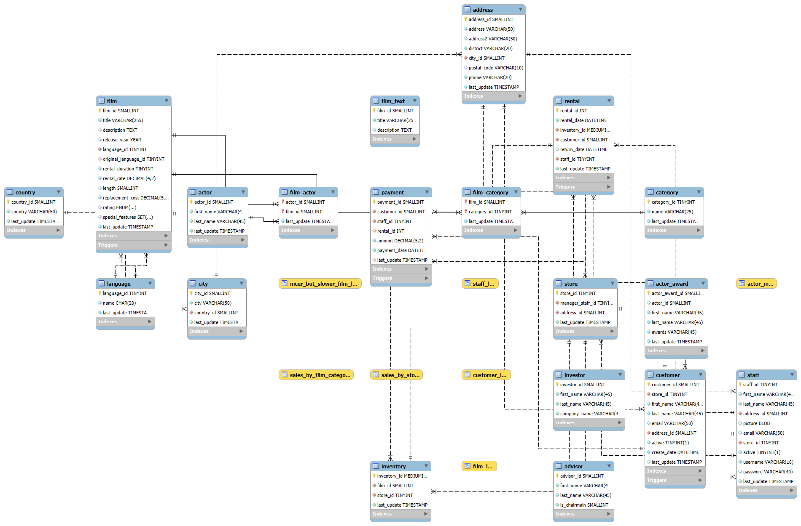
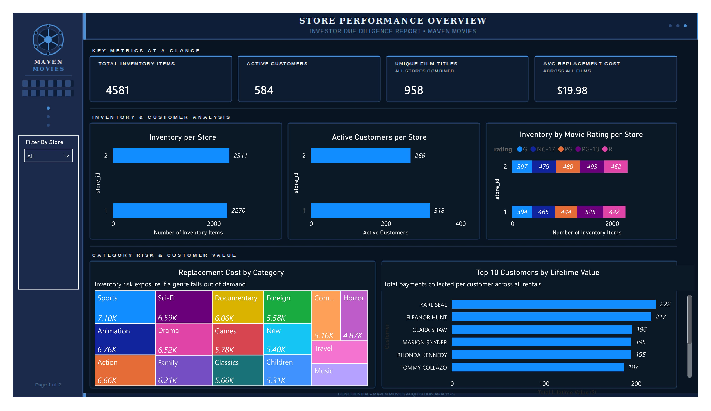
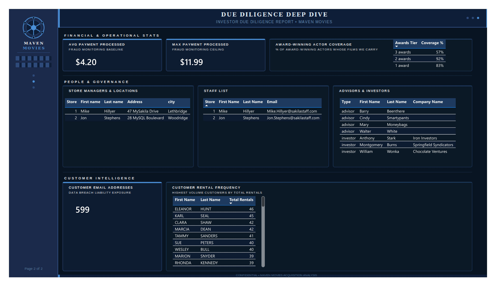
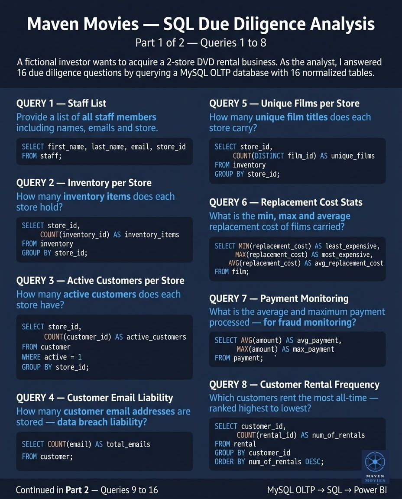
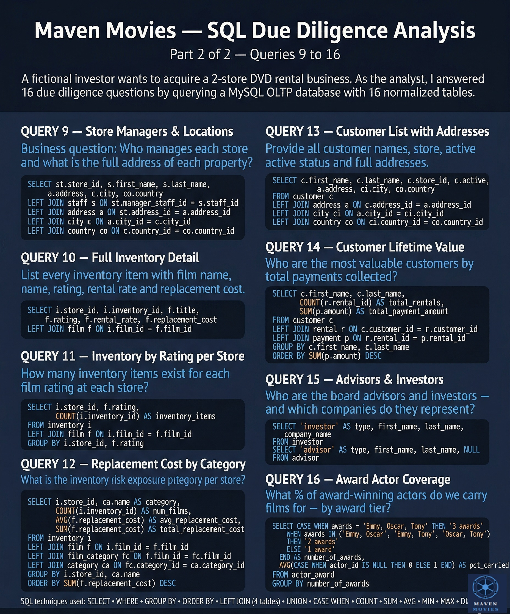

# 🎬 Maven Movies — SQL Due Diligence Analysis + Power BI Dashboard

## 1. Project Overview

**Project Title:** Maven Movies — Investor Due Diligence Analysis

**One-sentence summary:** An end-to-end data analytics project where I answered 16 investor due diligence questions by querying a MySQL OLTP database, then visualised the findings in a Power BI dashboard — using SQL as the analysis layer and Power BI purely as the presentation layer.

**Why this project matters:** In real organisations, data analysts are frequently asked to answer business questions directly from operational databases. This project simulates that scenario — a potential investor (Martin Moneybags) wants to assess whether a 2-store DVD rental business is worth acquiring. The analyst's job is to extract the answers from the data, not build a data model inside a BI tool.

---

## 2. Problem Statement

**Business problem:** A fictional investor wants to acquire a DVD rental business and needs answers to 16 due diligence questions before committing. The data lives in a MySQL OLTP database with 16 normalized tables — the same kind of system a real POS rental shop would use.

**Key questions answered:**
- How many inventory items does each store hold?
- How many active customers does each store have?
- What is the replacement cost exposure by film category?
- Who are the top 10 customers by lifetime value?
- What % of award-winning actors do we carry films for?
- Who manages each store, and what is their full address?
- What is the avg and max payment processed — for fraud monitoring?
- Who are the board advisors and investors?

**Success measure:** All 16 business questions answered accurately through SQL queries, presented in a clean 2-page Power BI dashboard that any non-technical executive can navigate.

---

## 3. Architecture & Pipeline

```
Maven Movies POS System
(MySQL OLTP — 16 normalized tables)
        ↓
SQL Queries (16 queries — all joins, aggregations, business logic)
        ↓
Power BI Desktop
(Native queries — Power BI receives clean pre-aggregated results)
        ↓
Power BI Dashboard
(Presentation layer only — no data modelling inside Power BI)
```

**Key architectural decision:** All data transformation happens in SQL. Power BI is used purely as a presentation layer — no joins, no DAX measures, no data modelling inside the tool. This is the correct approach when the source is an OLTP database and the questions are well-defined.

This project deliberately contrasts with a full pipeline approach (ETL → Data Warehouse → Power BI with star schema and DAX) which is appropriate when data updates continuously and time intelligence is required. That approach is demonstrated in my BCPulse project.

---

## 4. Dataset Details

**Source:** Maven Movies MySQL database (based on the Sakila sample database by MySQL)

**Database type:** OLTP (Online Transaction Processing) — not a data warehouse

**Tables:** 16 normalized tables including `film`, `inventory`, `customer`, `rental`, `payment`, `staff`, `store`, `address`, `city`, `country`, `category`, `film_category`, `actor`, `actor_award`, `advisor`, `investor`

**Data dictionary highlights:**

| Table | Description |
|---|---|
| `inventory` | Each physical DVD copy held at a store |
| `film` | Film details including rating, rental rate, replacement cost |
| `customer` | Customer records with active status and store assignment |
| `rental` | Every rental transaction |
| `payment` | Every payment made against a rental |
| `actor_award` | Award-winning actors and which award types they hold |
| `advisor` / `investor` | Board advisors and business investors |

---

## 5. Entity Relationship Diagram

The Maven Movies database consists of 16 normalized tables. The ER diagram below shows the relationships between all tables — this was the reference used when writing all JOIN queries.



---

## 6. SQL Queries Written

All 16 queries are in `MavenMovies_SQLQueries.sql`

**SQL techniques demonstrated:**

| Technique | Used in |
|---|---|
| `SELECT`, `WHERE`, `GROUP BY`, `ORDER BY` | Q1–Q8 |
| `COUNT`, `SUM`, `AVG`, `MIN`, `MAX` | Q2–Q7 |
| `COUNT(DISTINCT ...)` | Q5 |
| `LEFT JOIN` (up to 4 tables) | Q9, Q12, Q13, Q14 |
| `UNION` | Q15 |
| `CASE WHEN` | Q16 |

---

## 7. Dashboard Screenshots

### Page 1 — Store Overview


### Page 2 — Due Diligence Deep Dive


---

## 8. SQL Infographics

### Queries 1–8


### Queries 9–16


---

## 9. Power BI Dashboard (Published)

🔗 [View Live Dashboard](https://app.powerbi.com/groups/me/reports/0db1bdf8-0515-4db0-8639-d9e667df668f/a9ff31504ddadf2aab57?experience=power-bi)

> Note: Viewing requires a Power BI account. Screenshots and PDF are provided for open access.

📄 [Download PDF Version](OriginalMaven.pdf)

---

## 10. How to Run This Project

**Requirements:**
- MySQL 8.0 or above
- MySQL Workbench (or any SQL client)
- Power BI Desktop (free download from Microsoft)

**Step 1 — Set up the database:**
1. Download and install MySQL 8.0
2. Open MySQL Workbench
3. Open `create_mavenmovies.sql` — this script creates the entire Maven Movies database including all 16 tables and populates them with sample data
4. Run the entire script (Ctrl+Shift+Enter or click the lightning bolt ⚡ icon)
5. Verify by running `SELECT * FROM mavenmovies.film LIMIT 10;` — you should see film records returned

**Step 2 — Run the SQL queries:**
1. Open `MavenMovies_SQLQueries.sql` in MySQL Workbench
2. Run each query individually to see the results
3. All queries use the `mavenmovies` schema

**Step 3 — Open the Power BI dashboard:**
1. Download and install Power BI Desktop (free)
2. Open `OriginalMaven.pbix`
3. When prompted to refresh data, enter your MySQL credentials:
   - Server: `localhost`
   - Database: `mavenmovies`
   - Username: `root`
   - Password: your MySQL root password
4. Click Refresh — the dashboard will reload with your local data

---

## 11. How I Thought Through It

**Why SQL and not Python or Power BI for analysis?**

The data lives in a MySQL relational database. SQL is the native language of that database — it is the most direct, efficient tool for extracting answers from where the data already lives. Python would be overkill for structured business questions with no ML requirement. Doing data modelling inside Power BI would create unmaintainable logic as the data grows.

**Why no data modelling in Power BI?**

Each SQL query produces a clean, pre-aggregated result set. Power BI receives only the final answers — not raw tables. There are no relationships built inside Power BI, no DAX measures, no calculated columns. This is the correct separation of concerns: SQL handles logic, Power BI handles display.

**Trade-offs and limitations:**

- The dashboard is not truly live — it reflects a snapshot of the database at import time. In a real deployment, scheduled refresh would be configured via Power BI Service with a gateway connecting to MySQL.
- Some KPI cards (Unique Film Titles, Avg Replacement Cost) are business-wide metrics that do not respond to the store slicer — this is intentional and labelled clearly on the dashboard.
- This approach works well for a static due diligence scenario. For a continuously updating operational dashboard requiring time intelligence (MoM, YoY comparisons), a proper data warehouse with a star schema and DAX would be the correct approach — as demonstrated in my BCPulse project.

---

## 12. Key Insights for the Investor

- **Store 2** holds slightly more inventory (2,311 vs 2,270) but **Store 1** has significantly more active customers (318 vs 266)
- **Sports** carries the highest replacement cost exposure at $7.10K — the biggest risk if the genre loses popularity
- **Karl Seal** is the top customer by lifetime value at $222 total payments
- Maven Movies carries films for **92% of 2-award actors** and **83% of 1-award actors** — strong film library quality
- **599 customer email addresses** are stored — material data breach liability to flag for the investor
- Average payment processed is **$4.20** with a maximum of **$11.99** — useful baseline for fraud monitoring systems

---

## 13. What I'd Do Differently Next Time

- Add a proper ETL pipeline feeding a data warehouse so the dashboard refreshes automatically
- Build a star schema (fact_rentals → dim_film, dim_customer, dim_store, dim_date) to enable time intelligence and trend analysis
- Use DAX measures for more flexible calculations rather than pre-aggregating everything in SQL
- This is exactly the approach taken in my next project — BCPulse (BC Emergency Department Wait Time Dashboard)

---

## 14. Tools & Technologies

| Tool | Purpose |
|---|---|
| MySQL 8.0 | OLTP database — source of truth |
| MySQL Workbench | Query writing and ER diagram |
| Power BI Desktop | Dashboard building |
| Power BI Service | Publishing and sharing |
| SQL | All data extraction and transformation |

---

## 15. Files in This Repository

| File | Description |
|---|---|
| `create_mavenmovies.sql` | Database creation script — run this first to set up all 16 tables with sample data |
| `MavenMovies_SQLQueries.sql` | All 16 SQL queries with comments |
| `OriginalMaven.pbix` | Power BI dashboard file |
| `OriginalMaven.pdf` | Exported PDF of dashboard |
| `Dashboard1_StoreOverview.jpg` | Page 1 screenshot |
| `Dashboard2_DueDiligenceDeepDive.jpg` | Page 2 screenshot |
| `SQLInfographicPart1.jpg` | SQL queries 1–8 infographic |
| `SQLInfographicPart2.jpg` | SQL queries 9–16 infographic |
| `ERDiagram_MavenMovies.png` | Full ER diagram of all 16 tables |

---

## 16. About

Connect with me on [LinkedIn](https://www.linkedin.com/in/desmondchua2024/)

---

*"Not every project needs a star schema and DAX. Knowing when NOT to over-engineer is just as important as knowing how to build a full pipeline."*

